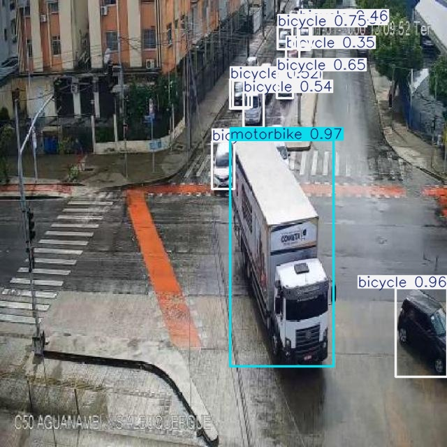

🚦 HỆ THỐNG NHẬN DIỆN ĐỐI TƯỢNG GIAO THÔNG SỬ DỤNG YOLOv8

📌 Tổng quan

Dự án xây dựng hệ thống nhận diện các đối tượng giao thông từ hình ảnh thực tế sử dụng mô hình YOLOv8 (Ultralytics).

## Ví dụ IPO hệ thống

| Ảnh gốc (Input) | Ảnh đã nhận diện (Output) |
|---|---|
|  |  |

> Minh họa luồng IPO: Input (ảnh gốc) → Process (YOLOv8 nhận diện) → Output (ảnh đã gán nhãn)

**Lưu ý:** Trong ví dụ output, mô hình đã gán nhãn sai: xe con bị nhận diện là bicycle và xe tải bị nhận diện là motorbike. Nguyên nhân là do mô hình huấn luyện với số epoch thấp, kích thước ảnh nhỏ và chưa sử dụng GPU, dẫn đến hiệu suất nhận diện chưa cao và dễ nhầm lẫn giữa các phương tiện có hình dạng tương tự.

Các lớp đối tượng bao gồm:

🚗 Car (Ô tô)

🏍 Motorbike (Xe máy)

🚲 Bicycle (Xe đạp)

🚶 Person (Người đi bộ)

Dự án triển khai đầy đủ pipeline của một bài toán Object Detection:

Chuẩn bị dữ liệu

Gán nhãn (Annotation)

Huấn luyện mô hình

Đánh giá hiệu suất

Thực hiện suy luận (Inference)

🎯 Mục tiêu

Xây dựng mô hình Deep Learning có khả năng phát hiện và phân loại phương tiện giao thông trong ảnh đường phố, đồng thời đánh giá hiệu suất bằng các chỉ số chuẩn như mAP, Precision và Recall.

🛠 Công nghệ sử dụng

Python

YOLOv8 (Ultralytics)

PyTorch

OpenCV

LabelImg (gán nhãn dữ liệu)

Matplotlib

Dataset giao thông (Kaggle)

⚙️ Cấu hình huấn luyện

Do giới hạn phần cứng (huấn luyện trên CPU), mô hình được train với cấu hình tối ưu cho mục đích thử nghiệm:

Model: YOLOv8n

Epochs: 3

Image size: 416x416

Thiết bị: CPU (Intel i5)

⚠ Lưu ý: Mô hình được huấn luyện với số epoch thấp và kích thước ảnh nhỏ nhằm tối ưu thời gian train trên CPU. Hiệu suất có thể cải thiện đáng kể nếu tăng số epoch, tăng kích thước ảnh và huấn luyện trên GPU.

📊 Kết quả đánh giá (Validation Set)
Chỉ số	Giá trị
Precision	0.788
Recall	0.641
mAP@50	0.713
mAP@50-95	0.482

Mô hình đạt mức hiệu suất khá trong điều kiện huấn luyện hạn chế. Một số trường hợp có thể xảy ra nhầm lẫn giữa các phương tiện có đặc điểm hình học tương tự (ví dụ: truck và motorbike) do số epoch thấp và cấu hình ảnh nhỏ.

📂 Cấu trúc thư mục
dataset/
  images/
    train/
    val/
  labels/
    train/
    val/
data.yaml
train.py
predict.py
evaluate.py
README.md
🚀 Hướng dẫn sử dụng
1️⃣ Cài đặt thư viện
pip install ultralytics opencv-python matplotlib labelImg
2️⃣ Huấn luyện mô hình
python train.py
3️⃣ Đánh giá mô hình
python evaluate.py
4️⃣ Dự đoán trên ảnh
python predict.py

Hoặc sử dụng CLI:

yolo detect predict model=runs/detect/train2/weights/best.pt source=test.jpg
⚠️ Hạn chế hiện tại

Huấn luyện với số epoch thấp (3 epoch)

Chưa sử dụng GPU

Kích thước ảnh 416x416 có thể ảnh hưởng đến việc phát hiện vật thể nhỏ

Dataset có thể chưa cân bằng hoàn toàn giữa các lớp

🔮 Hướng phát triển trong tương lai

Tăng số epoch (10–50)

Tăng image size lên 640

Huấn luyện trên GPU

Tối ưu hyperparameter

So sánh YOLOv8n và YOLOv8s

Xây dựng web demo bằng Flask/FastAPI

Triển khai realtime webcam detection

💡 Kiến thức & kỹ năng đạt được

Hiểu rõ pipeline của bài toán Object Detection

Làm việc với dataset YOLO format

Đánh giá mô hình bằng mAP, Precision, Recall

Phân tích trade-off giữa tốc độ và độ chính xác

Thực hành triển khai mô hình từ train đến inference

